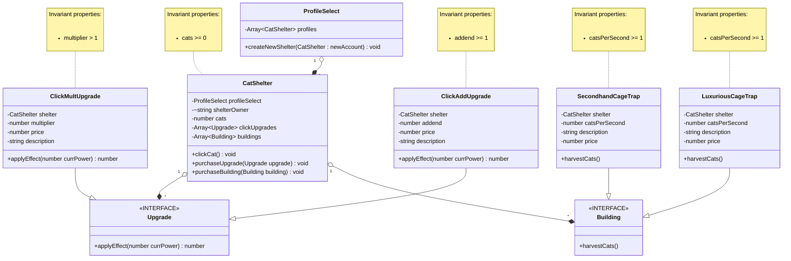

# Domain model

### updates:
- another class, ProfileSelect, has been created to hold onto all profiles in the application. it is composed of CatShelters, which function as accounts
- CatShelter has been given a property "shelterOwner" to help distinguish between users 
- another interface, "building", has been added; implemented by 2 new classes, the cage traps
- both implementations of "upgrade" have been given aggregate references to their shelters 
- catShelters get an array of buildings and a method to purchase new buildings
- All upgrades and buildings have meaningful descriptions as properties