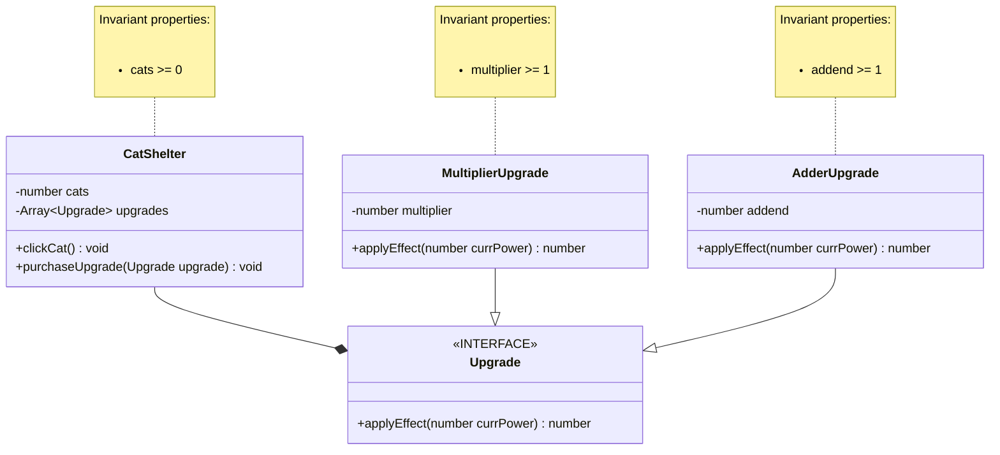

# Domain model

### updates:
##### changed CatShelter to not have properties for click power, but instead the number of cats gained will be calculated in the clickCat method by looking at each upgrade every time it's clicked 