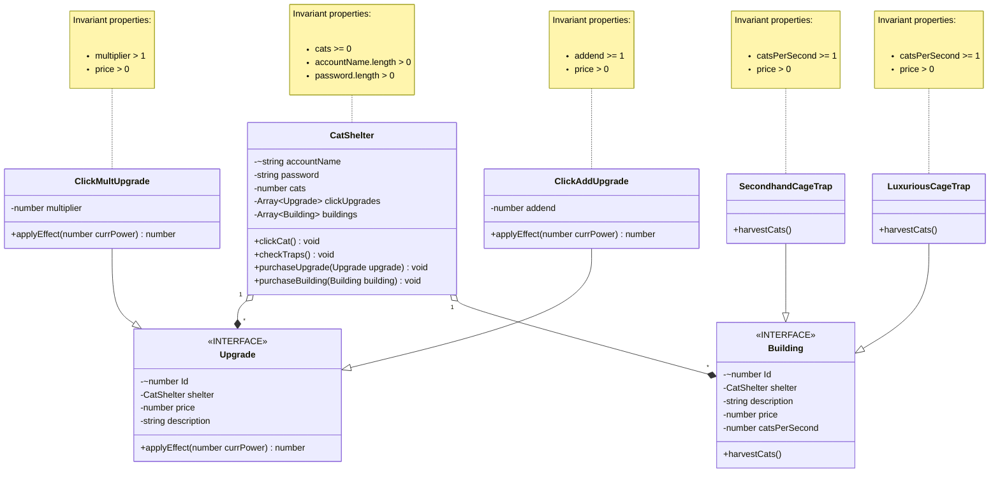

# Domain model

### updates:
- CatShelter has been given the properties: accountName and password so it can function as a profile
- another interface, "building", has been added; implemented by 2 new classes, the cage traps
- both implementations of "upgrade" have been given aggregate references to their shelters 
- catShelters get an array of buildings and a method to purchase new buildings
- All upgrades and buildings have meaningful descriptions as properties, as well as serial ID's to identify them as unique instances

##### NOTE: as per a conversation I had with Franklin, I decided to delete the profileSelect as its own class, and I made it so that catShelter has profile functionality as an alternative. We discussed that yes, it isnt very cohesive, but it makes the database easier to manage, and should I ever need to extract the concept of profile out of this class, it wouldnt be that difficult.
