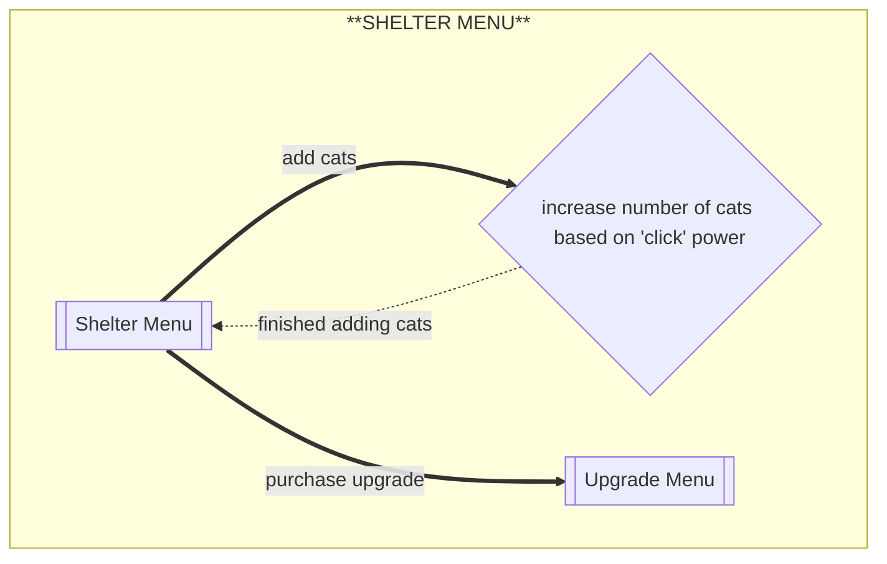
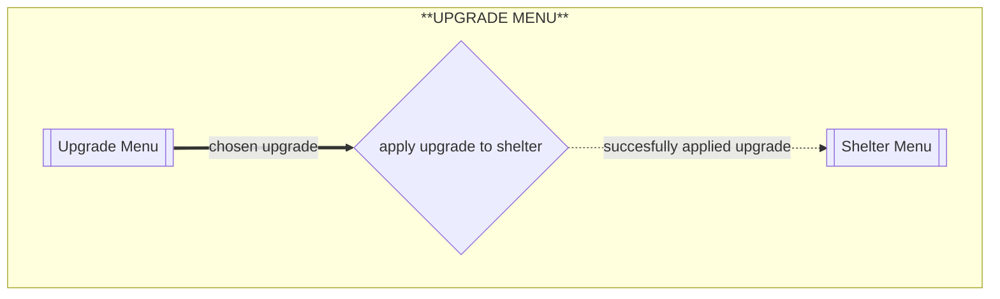

# Flows of interaction

## Shelter menu

When the program starts, the user is first brought to the 'cat clicking' interface. 

## Purchase Upgrade

this is what it will look like to "purchase" an upgrade in the program
