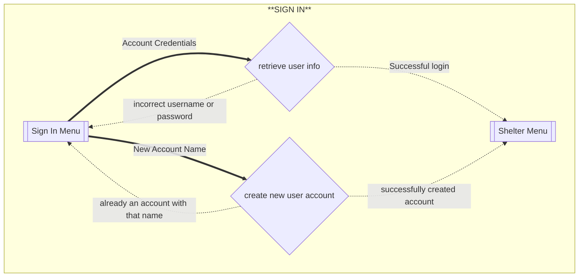
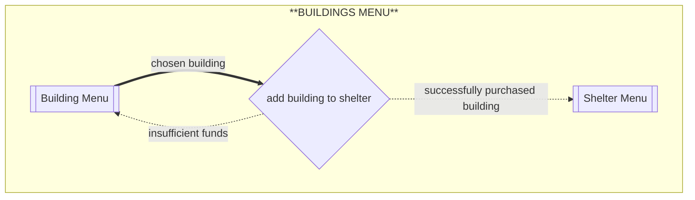
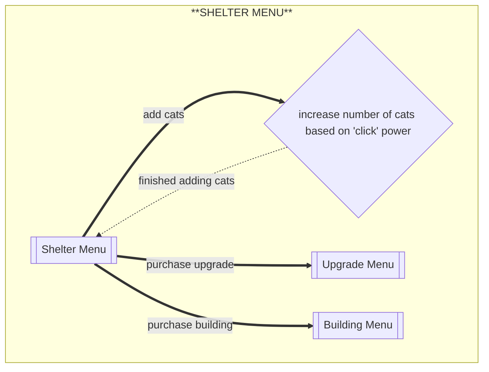
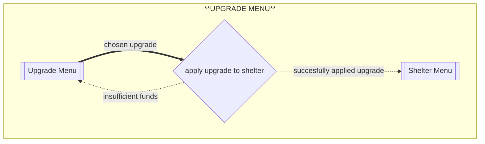

# Flows of interaction

## Create account/Sign in (Phase 2)
The user is always forced to sign in first before anything else.
here is the process for creating account and signing in, including error state.

## purchase building (Phase 2)
here is the flow for purchasing a building 

## shelter menu
this is the flow of interaction for the home page after a user has signed in

## Purchase Upgrade (updated to handle error state)

this is what it will look like to "purchase" an upgrade in the program

### changes to phase 1 diagrams
- the shelter menu diagram so it expresses how a user will purchase a building
- the purchase upgrade flow now expresses how there can be an error state when attempting to purchase 

### changes from initial phase 2 submission 
- the user is now forced to sign in or create account before anything, and after refreshes of the program. the sign in flow now includes creating an account as well.
