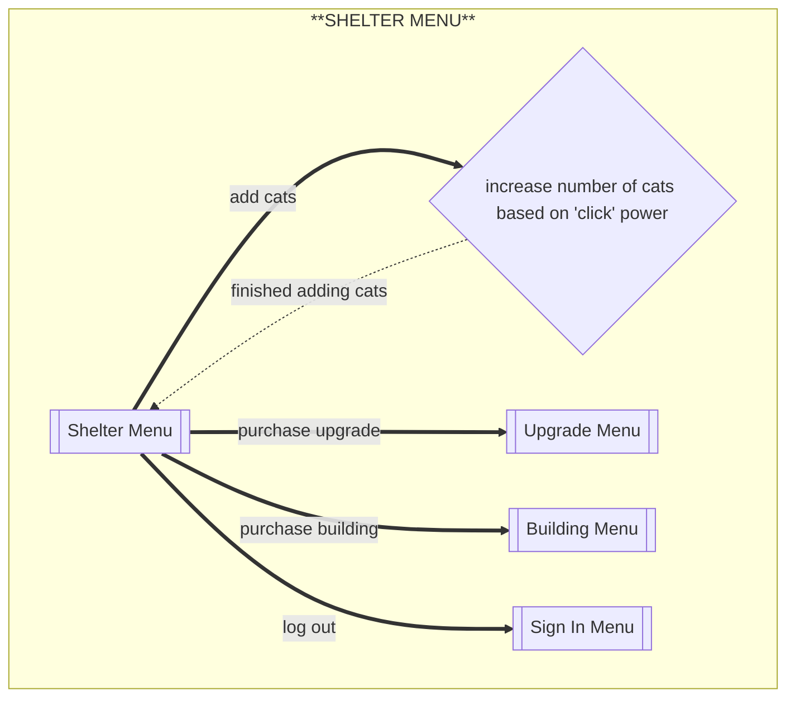
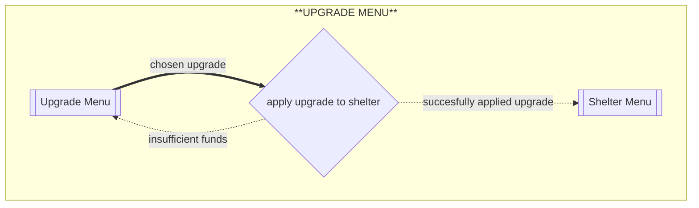
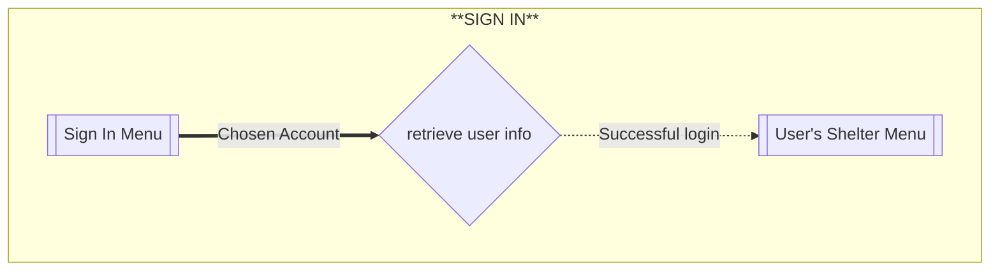
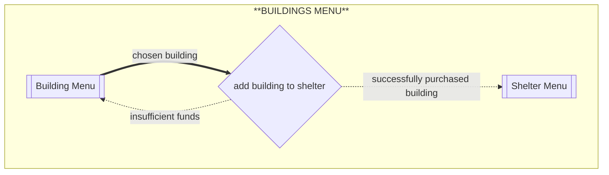

# Flows of interaction

## Shelter menu (updated for multi user functionality)

When the program starts, the user is first brought to the 'cat clicking' interface. 

## Purchase Upgrade (updated to handle error state)

this is what it will look like to "purchase" an upgrade in the program

## Create account/Sign in (Phase 2)
here is the process for creating account and signing in

## purchase building (Phase 2)
here is the flow for purchasing a building 

### changes 
after phase 1, i changed a few things from the phase 1 diagrams
-  the shelter menu diagram so it expresses how a user will log out and purchase a building
-  the purchase upgrade flow now expresses how there can be an error state when attempting to purchase 